# Wireshark e Monitoração de Protocolos de Aplicação

|Alunos
|-----------------
|[Arthur Antunes de Souza Both](https://github.com/ArthurBoth)
|[Gabriel Coelho](https://github.com/coelhogbr)

## Objetivo

Monitorar pacotes que estão sendo enviados ou recebidos pela máquina. Identificar
protocolos de aplicação e a constituição do cabeçalho (header) desses protocolos, o
encapsulamento pelos demais protocolos da pilha e o fluxo de comunicação entre
origem e destino.

## Descrição

Utilize o Wireshark para capturar pacotes dos seguintes protocolos:

- ARP
- ICMP
- TCP
- UDP
- Ipv4
- DNS
- DHCP

1. Para cada protocolo, identifique:

    `ARP`

    A) Os campos do cabeçalho (header).

    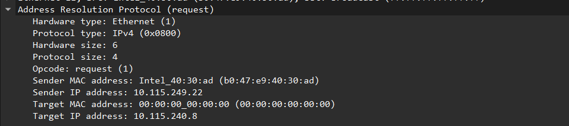

    B) O encapsulamento do protocolo pelos demais níveis da pilha TCP/IP:

    Ba) Observe e faço um esboço de como o protocolo é encapsulado por
        todos os demais níveis da pilha.

    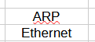

    Bb) Observe e responda se todas as informações do cabeçalho, do
        protocolo de aplicação e dos demais níveis, podem ser acessadas em
        texto aberto ou estão criptografadas.

        Resposta: Não podem ser acessadas, ou seja, são criptografadas

    `ICMP`

    A) Os campos do cabeçalho (header).

    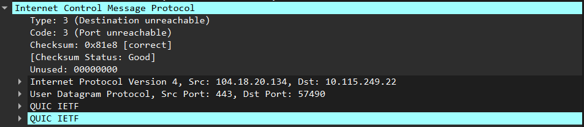

    B) O encapsulamento do protocolo pelos demais níveis da pilha TCP/IP:

    Ba) Observe e faço um esboço de como o protocolo é encapsulado por
        todos os demais níveis da pilha.

    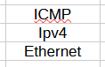

    Bb) Observe e responda se todas as informações do cabeçalho, do
        protocolo de aplicação e dos demais níveis, podem ser acessadas em
        texto aberto ou estão criptografadas.

        Resposta: Podem ser acessadas, ou seja, não são criptografadas

    `TCP`

    A) Os campos do cabeçalho (header).

    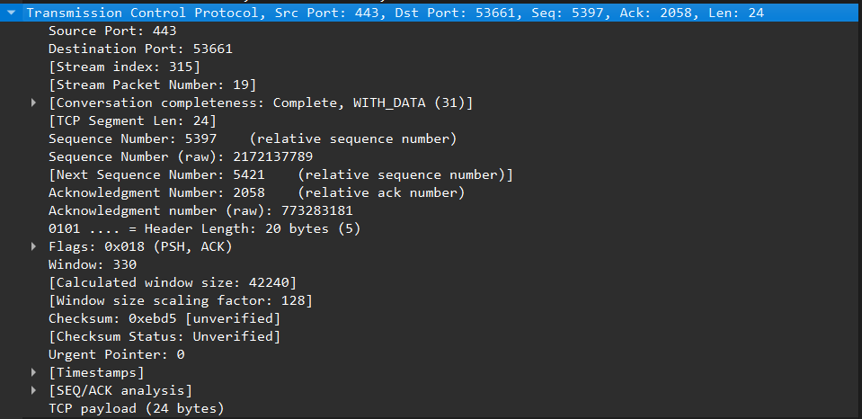

    B) O encapsulamento do protocolo pelos demais níveis da pilha TCP/IP:

    Ba) Observe e faço um esboço de como o protocolo é encapsulado por
        todos os demais níveis da pilha.

    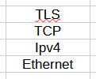

    Bb) Observe e responda se todas as informações do cabeçalho, do
        protocolo de aplicação e dos demais níveis, podem ser acessadas em
        texto aberto ou estão criptografadas.

        Resposta: Podem ser acessadas, ou seja, não são criptografadas

    `UDP`

    A) Os campos do cabeçalho (header).

    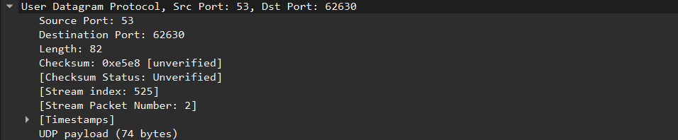

    B) O encapsulamento do protocolo pelos demais níveis da pilha TCP/IP:

    Ba) Observe e faço um esboço de como o protocolo é encapsulado por
        todos os demais níveis da pilha.

    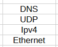

    Bb) Observe e responda se todas as informações do cabeçalho, do
        protocolo de aplicação e dos demais níveis, podem ser acessadas em
        texto aberto ou estão criptografadas.

        Resposta: Podem ser acessadas, ou seja, não são criptografadas

    `Ipv4`

    A) Os campos do cabeçalho (header).

    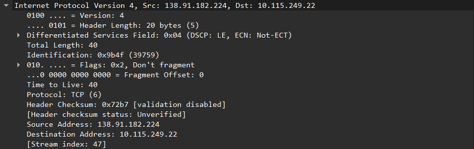

    B) O encapsulamento do protocolo pelos demais níveis da pilha TCP/IP:

    Ba) Observe e faço um esboço de como o protocolo é encapsulado por
        todos os demais níveis da pilha.

    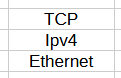

    Bb) Observe e responda se todas as informações do cabeçalho, do
        protocolo de aplicação e dos demais níveis, podem ser acessadas em
        texto aberto ou estão criptografadas.

        Resposta: Podem ser acessadas, ou seja, não são criptografadas

    `DNS`

    A) Os campos do cabeçalho (header).

    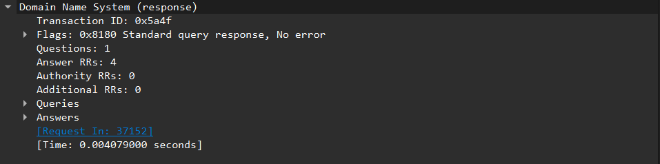

    B) O encapsulamento do protocolo pelos demais níveis da pilha TCP/IP:

    Ba) Observe e faço um esboço de como o protocolo é encapsulado por
        todos os demais níveis da pilha.

    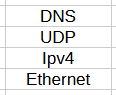

    Bb) Observe e responda se todas as informações do cabeçalho, do
        protocolo de aplicação e dos demais níveis, podem ser acessadas em
        texto aberto ou estão criptografadas.

        Resposta: Podem ser acessadas, ou seja, não são criptografadas

    `DHCP`

    A) Os campos do cabeçalho (header).

    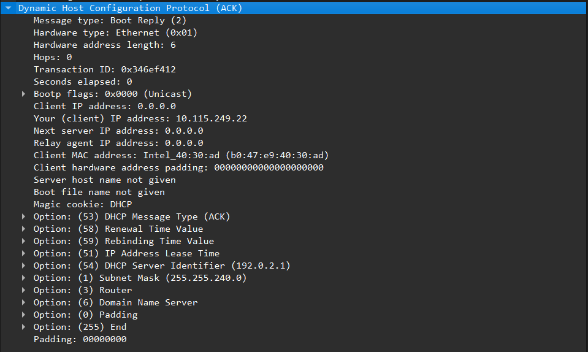

    B) O encapsulamento do protocolo pelos demais níveis da pilha TCP/IP:

    Ba)  Observe e faço um esboço de como o protocolo é encapsulado por
        todos os demais níveis da pilha.

    

    Bb) Observe e responda se todas as informações do cabeçalho, do
        protocolo de aplicação e dos demais níveis, podem ser acessadas em
        texto aberto ou estão criptografadas.

        Resposta: Podem ser acessadas, ou seja, não são criptografadas

2. Apenas para os **protocolos de aplicação** apresente:

    `DNS`

    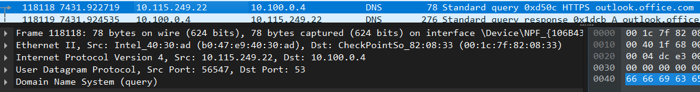

    a) O fluxo de mensagens entre origem e destino. Trace um diagrama de
    comunicação mostrando a conversa entre a origem e o destino,
    apresentando:

    - O endereço das portas de origem e destino (fim-a-fim) utilizadas no
    protocolo de transporte.
    - O endereço IPv4 (endereço fim-a-fim) da origem e do destino utilizado
    em cada datagrama do fluxo monitorado para cada protocolo de
    aplicação.
    - O endereço MAC (endereço ponto-a-ponto) da origem e do destino
    utilizado em cada datagrama do fluxo monitorado para cada protocolo
    de aplicação.
    - Identifique as máquinas às quais o endereço MAC pertence.

    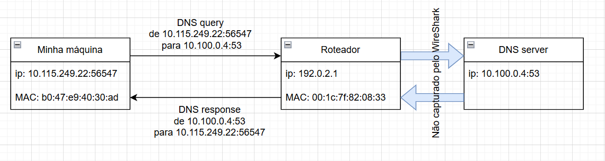

    `DHCP`

    a) O fluxo de mensagens entre origem e destino. Trace um diagrama de
    comunicação mostrando a conversa entre a origem e o destino,
    apresentando:

    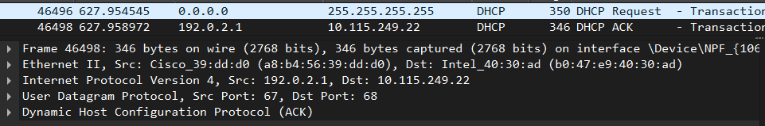

    - O endereço das portas de origem e destino (fim-a-fim) utilizadas no
    protocolo de transporte.
    - O endereço IPv4 (endereço fim-a-fim) da origem e do destino utilizado
    em cada datagrama do fluxo monitorado para cada protocolo de
    aplicação.
    - O endereço MAC (endereço ponto-a-ponto) da origem e do destino
    utilizado em cada datagrama do fluxo monitorado para cada protocolo
    de aplicação.
    - Identifique as máquinas às quais o endereço MAC pertence.

    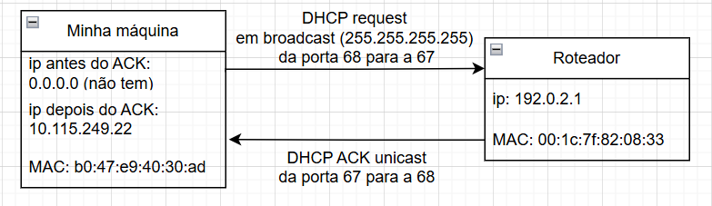

3. Em um terminal, executar o comando: nslookup -type=SOA `moodle.pucrs.br`

    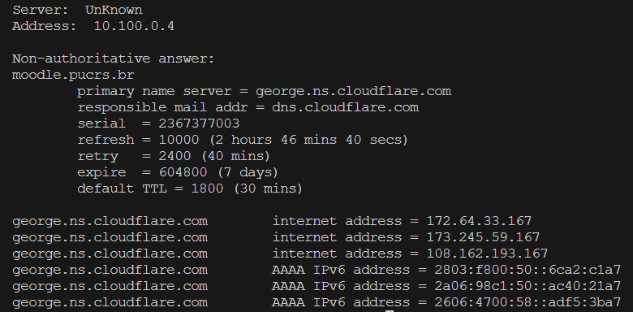

    a) Qual é o protocolo de aplicação utilizado?

        Protocolo DNS

    b) De quanto em quanto tempo o servidor secundário consulta o primário
    para verificar se houve alguma alteração em sua base de dados?

        A cada 2 horas, 46 minutos e 40 segundos (10000 segundos)

    c) Por quanto tempo o servidor secundário funciona depois que o primeiro
    caiu?

        Por 7 dias (604800 segundos)

    d) Quanto tempo as informações consultadas ficam na cache de outros
    servidores?

        Por 30 minutos (1800 segundos)

4. Siga as dicas ao final do documento para executar o DHCP e responda as
seguintes questões:

    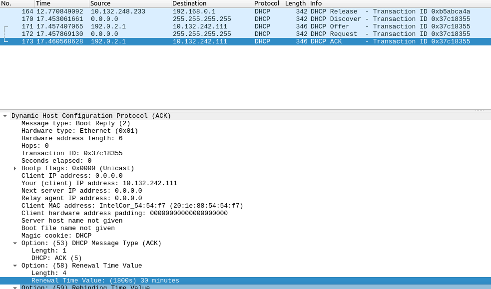

    a) O que permite identificar os vários pacotes pertencentes a cada
    transação?

        O campo `Transaction ID` no cabeçalho do DHCP permite identificar os
        pacotes pertencentes a cada transação.

    b) Qual o endereço IP inicial do cliente quando ele solicita um endereço
    IP?

        O Cliente posssui o endereço de `0.0.0.0`

    c) Qual o endereço IP inicial do servidor DHCP?

        O cliente envia uma mensagem de broadcast `255.255.255.255`

    d) Por quanto tempo fica valido o IP atribuído?

        Por 30 minutos (1800 segundos)

    e) Que informações são fornecidas pelo servidor ao responder a um
    pedido de endereço IP?

        No cabeçado do DHCP, há um `Message Type` que indica o tipo de
        mensagem, `1` para `Boot Request`, `2` para `Boot Reply
