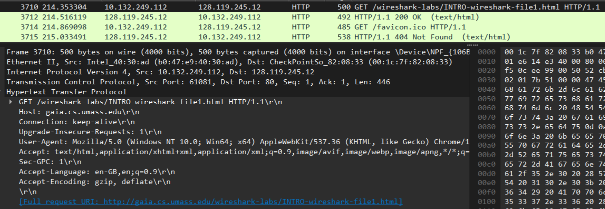
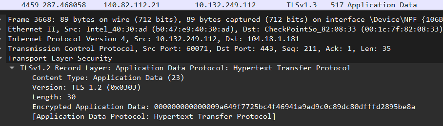
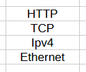
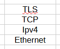
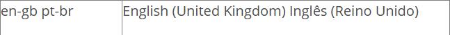
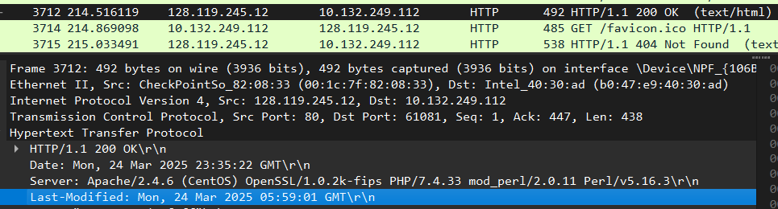
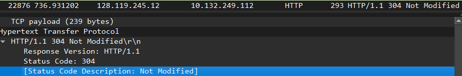

# Monitoração do Protocolo HTTP e HTTPS

|Alunos
|-----------------
|[Arthur Antunes de Souza Both](https://github.com/ArthurBoth)
|[Gabriel Coelho](https://github.com/coelhogbr)

## Objetivo

Monitorar pacotes dos protocolos de aplicação HTTP e HTTPS, identificar a
constituição do cabeçalho (header), o encapsulamento pelos demais protocolos da
pilha e o fluxo de comunicação entre origem e destino.

## Descrição

Utilize o Wireshark para capturar pacotes do protocolo HTTP e HTTPS:
Para cada protocolo, identifique:

- O encapsulamento do protocolo pelos demais níveis da pilha TCP/IP





1. Observe e descreva como o protocolo é encapsulado por todos os
demais níveis da pilha;

    
    

1. Observe e responda se todas as informações do cabeçalho, do
protocolo de aplicação e dos demais níveis, podem ser acessadas em
texto aberto ou estão criptografadas.

    ```plaintext
    As informações relacionadas ao HTTP podem ser acessadas em texto aberto.
    As informações relacionadas ao HTTPS estão criptografadas. 
    ```

1. Caso o cabeçalho esteja em texto, responda as questões a seguir:

    a) Qual é a versão do protocolo HTTP que está sendo usada?

    ```plaintext
    HTTP/1.1
    ```

    b) Qual é a linguagem que seu browser indica que pode aceitar?

    ```plaintext
    Inglês do Reino Unido
    ```

    

    Fonte: [https://www.alphatrad.pt/o-codigo-das-linguas](https://www.alphatrad.pt/o-codigo-das-linguas)

    c) Qual é o endereço IP de seu computador e do servidor?

    ```plaintext
    Endereço IP do computador: 10.132.249.112
    Endereço IP do servidor:   128.119.245.12
    ```

    d) Quando foi a última vez que o arquivo HTML que você está usando foi modificado no servidor?

    ```plaintext
    Last-Modified: Mon, 24 Mar 2025 05:59:01 GMT\r\n
    ```

    

    e) Que informações mantidas nesses protocolos possibilitam identificar o navegador e o servidor web?

    ```plaintext
    O campo User-Agent.

    User-Agent: Mozilla/5.0 (Windows NT 10.0; Win64; x64) AppleWebKit/537.36 (KHTML, like Gecko) Chrome/134.0.0.0 Safari/537.36\r\n
    ```

    f) Dê um reload na página e informe se ela estava em cache no seu browser.

    ```plaintext
    Ela ainda estava em cache, visto que o servidor respondeu com um código 304 (Not Modified).
    ```

    
