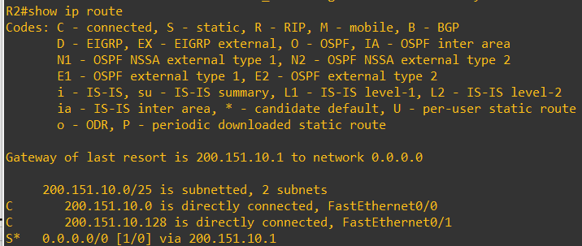
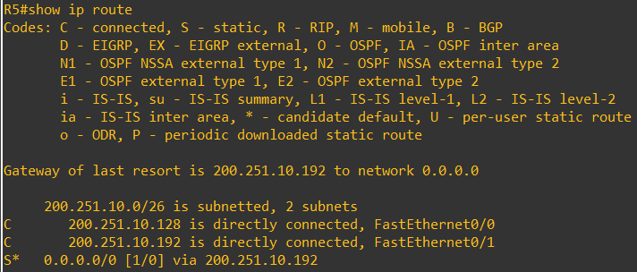
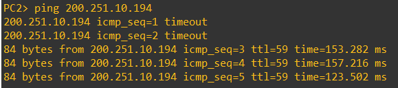
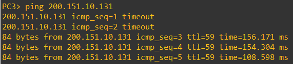
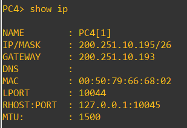

# Configurando Subredes com IPv4 e Roteamento Estático

|Alunos
|-----------------
|[Arthur Antunes de Souza Both](https://github.com/ArthurBoth)
|[Paola Lopes](https://github.com/thepaola)
|[Maria Eduarda Maia](https://github.com/DudaWendelMaia)

## Objetivo

Criar e configurar uma rede local, usando um simulador de rede para exercitar a
configuração do endereçamento IPv4 e do roteamento estático.

## Descrição

1. Usando o simulador crie uma rede local, contendo os seguintes elementos:

   - Pelo menos 5 Roteadores: os roteadores devem estar conectados entre si, por
   enlaces ponto-a-ponto, formando o backbone da rede local.
   - Pelo menos 2 subredes com hosts ao todo: para a criação da subrede
   conecte um switch Ethernet em cada roteador, para ligação de computadores
   e outros dispositivos.

   

2. A rede local deve atender os seguintes requisitos quanto ao endereçamento,
roteamento e tradução de endereços:

   - Deve ser utilizado um endereço público para o endereçamento das subredes.
   Utilize as máscaras de subrede que forem mais adequadas para o seu projeto
   de endereçamento.
   - Deve ser configurado o roteamento estático nos 5 roteadores da sua rede
   local, devendo haver conectividade entre todas as subredes.

   ```plaintext
   Escolhemos por ter duas redes, uma com 4 e outra com 2 subredes.
   Esta é uma tabela com os endereços IPs e as máscaras de subrede:
   ```

   | Endereço de Rede | Endereço de Broadcast | Máscara de rede |      Intervalo de endereços
   |:----------------:|:---------------------:|:---------------:|:-------------------------------:
   |  200.151.10.0    |     200.151.10.127    | 255.255.255.128 | 200.151.10.1   - 200.151.10.126
   |  200.151.10.128  |     200.151.10.255    | 255.255.255.128 | 200.151.10.129 - 200.151.10.254
   |  200.251.10.0    |     200.251.10.63     | 255.255.255.192 | 200.251.10.1   - 200.251.10.62
   |  200.251.10.64   |     200.251.10.127    | 255.255.255.192 | 200.251.10.65  - 200.251.10.126
   |  200.251.10.128  |     200.251.10.191    | 255.255.255.192 | 200.251.10.129 - 200.251.10.190
   |  200.251.10.192  |     200.251.10.255    | 255.255.255.192 | 200.251.10.193 - 200.251.10.254

   

3. Após a criação e configuração da rede local no simulador, gere tráfego com ping a
partir dos hosts e dos roteadores para validar a sua configuração.

   ### Evidências

   #### R1

   

   

   

   

   

   

   

   

   

   #### R2

   

   

   

   

   

   

   

   

   

   #### R3

   

   

   

   

   

   

   

   

   

   #### R4

   

   

   

   

   

   

   

   

   

   #### R5

   

   

   

   

   

   

   

   

   

   #### PC1

   

   

   

   

   

   

   

   

   

   #### PC2

   

   

   

   

   

   

   

   

   

   #### PC3

   

   

   

   

   

   

   

   

   

   #### PC4

   

   

   

   

   

   

   

   

   
